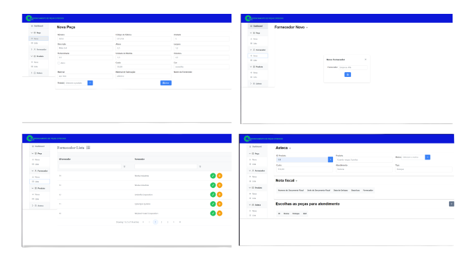

    

 
 
 

    

 
<h2>Sistema de Gerenciamento de Peças e Pedidos</h2>
<h3> 1 - Visão Geral do Software </h3>

O sistema de assistência técnica terceirizada é uma solução implementada por uma empresa para fornecer suporte após a venda. Os dados do cliente e do produto são enviados ao sistema gerando a nota fiscal da empresa para que caso ocorra algum problema, será a partir desta nota fiscal que será iniciado o atendimento. Técnicos qualificados são designados para lidar com o suporte, e o progresso é acompanhado. Após a resolução, são registradas as informações de fechamento e o sistema gera relatórios para a empresa. Em resumo, o sistema garante suporte eficiente, resolução de problemas e satisfação do cliente após a venda.

<h4> 1.1 - Objetivo do Software </h4>

   O objetivo do Gerenciamento de Peças e Pedidos - GPP é fornecer um suporte eficiente e de qualidade aos clientes após a venda de um produto ou serviço. Ele busca garantir a resolução rápida e eficaz de problemas técnicos, promovendo a satisfação do cliente e fortalecendo a reputação da empresa. O software visa facilitar o gerenciamento dos casos de assistência, desde o registro inicial até o fechamento do chamado, proporcionando uma experiência positiva e um atendimento personalizado aos clientes.

    

<h4> 1.2 - Escopo do Projeto e Requisitos de Software </h4>

O projeto envolve o desenvolvimento de um sistema de assistência técnica terceirizada para fornecer suporte aos clientes após a venda de produtos ou serviços. 

O escopo inclui as seguintes funcionalidades:

<li> 1 - Registro de casos: O sistema permitirá o registro de novos casos de assistência técnica, incluindo informações do cliente, detalhes do produto, número de série e garantia.
<li> 2 - Acompanhamento de casos: O sistema permitirá o acompanhamento do progresso dos casos de assistência técnica, registrando interações entre o cliente e o técnico, atualizações de status e soluções propostas.
<li> 3 - Comunicação com clientes: O sistema facilitará a comunicação entre os técnicos e os clientes, permitindo o envio de mensagens, agendamento de visitas técnicas e obtenção de informações adicionais sobre os problemas enfrentados.
<li> 4 - Registro de soluções: O sistema registrará as soluções adotadas para resolver os problemas dos clientes, incluindo peças substituídas, procedimentos realizados e qualquer outra ação tomada.
<li> 5 - Fechamento de casos: O sistema permitirá o registro das informações de fechamento dos casos, incluindo a descrição da solução adotada e o feedback do cliente.

 

 Fundamentado nas necessidades levantadas com o cliente, foram identificados os seguintes requisitos funcionais :
 
 

<table>
    <thead>
    <tr>
        <th>ID</>
        <th> Nome </th>
        <th>DESCRIÇÃO</>
    </tr>
    </thead>
    <tbody>
        <tr>
            <td><b>RF01</b></td>
            <td><b>Casos</b></td>
            <td>O sistema deve permitir o registro de novos casos de assistência técnica, incluindo informações do cliente, detalhes do produto, número de série e garantia.</td>
        </tr>
        <tr>
            <td><b>RF02</b></td>
            <td><b>Progresso</b></td>
            <td>O sistema deve permitir o acompanhamento do progresso dos casos de assistência técnica, registrando interações entre o cliente e o técnico, atualizações de status e soluções propostas.</td>
        </tr>
        <tr>
            <td><b>RF03</b></td>
            <td><b>Técnicos</b></td>
            <td>O sistema deve permitir a designação de técnicos qualificados para lidar com os casos de assistência técnica, levando em consideração a disponibilidade e as habilidades necessárias.</td>
        </tr>
        <tr>
            <td><b>RF04</b></td>
            <td><b>Soluções</b></td>
            <td>O sistema deve registrar as soluções adotadas para resolver os problemas dos clientes, incluindo peças substituídas, procedimentos realizados e outras ações tomadas.</td>
        </tr>
     
</table>

 
<h4> 1.4 - Modelo de Domínio </h2>

A documentação do modelo Entidade-Relacionamento (ER) é uma etapa crucial no processo de desenvolvimento de um sistema de informação. O modelo ER é usado para representar a estrutura do banco de dados, incluindo as entidades, relacionamentos e atributos. A partir desse modelo, é possível criar um esquema de banco de dados que possa ser implementado em um sistema de gerenciamento de banco de dados (SGBD). Neste documento, apresentaremos o modelo ER para Sistema de Controle de Acesso a Ambientes que contém a descrição detalhada dessa estrutura, incluindo as entidades, relacionamentos, chaves primárias e estrangeiras.

    

 
