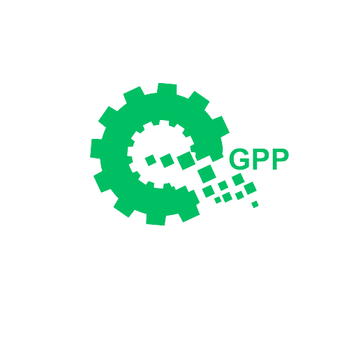

    

 
 
 

    

 
<h2>Sistema de Gerenciamento de Peças e Pedidos</h2>
<h3> 1 - Visão Geral do Software </h3>

O sistema de assistência técnica terceirizada é uma solução implementada por uma empresa para fornecer suporte após a venda. Os dados do cliente e do produto são enviados ao sistema gerando a nota fiscal da empresa para que caso ocorra algum problema, será a partir desta nota fiscal que será iniciado o atendimento. Técnicos qualificados são designados para lidar com o suporte, e o progresso é acompanhado. Após a resolução, são registradas as informações de fechamento e o sistema gera relatórios para a empresa. Em resumo, o sistema garante suporte eficiente, resolução de problemas e satisfação do cliente após a venda.

<h4> 1.1 - Objetivo do Software </h4>

   O objetivo do Gerenciamento de Peças e Pedidos - GPP é fornecer um suporte eficiente e de qualidade aos clientes após a venda de um produto ou serviço. Ele busca garantir a resolução rápida e eficaz de problemas técnicos, promovendo a satisfação do cliente e fortalecendo a reputação da empresa. O software visa facilitar o gerenciamento dos casos de assistência, desde o registro inicial até o fechamento do chamado, proporcionando uma experiência positiva e um atendimento personalizado aos clientes.

    

